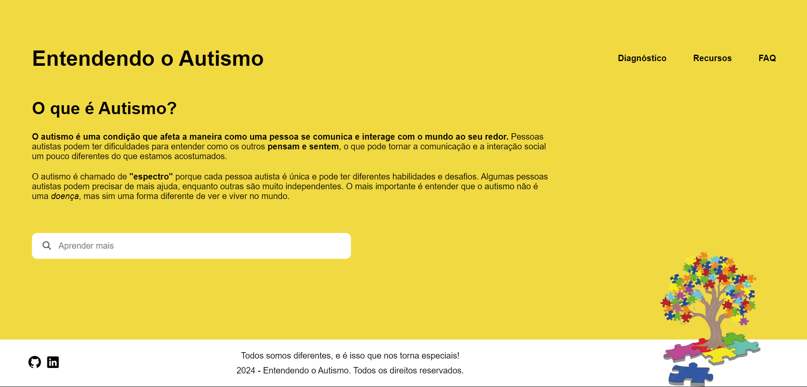

# Entendendo o Autismo 

## 📚 Descrição 
Entendendo o Autismo é uma base de conhecimento criada durante a imersão dev da Alura com o Google Gemini. O projeto tem como objetivo disponibilizar informações e conscientizar sobre o autismo de forma simples e acessível. A plataforma oferece conteúdos educativos, além de respostas para perguntas frequentes e recursos úteis sobre o tema.

## 🚀 Tecnologias 
Esse projeto foi desenvolvido usando:

- HTML: Estrutura das páginas.
- CSS: Estilização e layout.
- JavaScript: Funcionalidades interativas.

## 🛠️ Como Executar Localmente

- Clone este repositório:
  git clone https://github.com/alinerhanny/entendendo-o-autismo.git
- Acesse a pasta do projeto:
  cd entendendo-o-autismo
- Abra o arquivo index.html em seu navegador para acessar o site localmente.

 ##  💡 Contribuição 
 Contribuições são bem-vindas! Sinta-se à vontade para enviar pull requests ou abrir issues.

 ## 📜 Licença
 Este projeto está licenciado sob a licença MIT.
